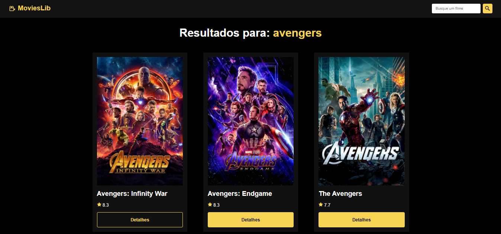

# Projetos-React

## [Movies Lib](./movies_lib/)
Projeto que utiliza uma API de filmes.

## [Portfólio](./portfolio/)
Portfólio pessoal feito com React + SASS.

## [Quiz](./quiz/)
Esse projeto apresenta 5 perguntas básicas de programação e mostra a pontuação final.

## [To-do](./todo/)
Projeto que cria tarefas (to-do) e se comunica com o banco de dados através dos métodos HTTP com o Fetch API do javascript.

