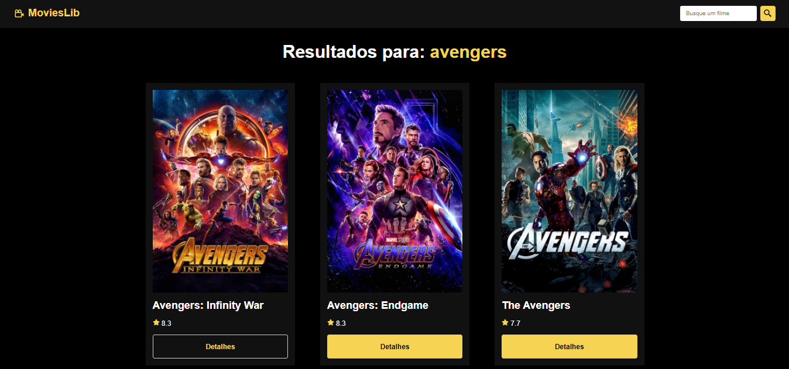

# MOVIES LIB

Projeto que utiliza uma API de filmes.

## Comandos utilizados nesse projeto

### `npm create vite@latest`

Cria um projeto Vite + React.js

* Project name: movies_lib
* Framework: react
* Variant: javascript

### `npm install react-icons react-router-dom`

Instala o pacote de ícones do react e o router

### `npm run dev`

Comando utilizado para rodar a aplicação no localhost.