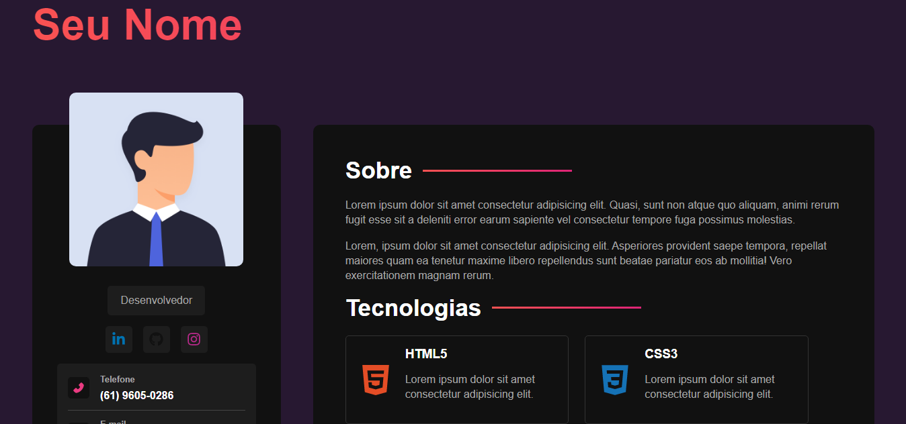

# Portfólio

Portfólio pessoal feito com React + SASS. 

## Comandos utilizados nesse projeto

### `npm create vite@latest`

* Cria um projeto Vite + React.js

* Nome do projeto: portfolio

* Framework: react javascript

* *npm install* para instalar os pacotes

### `npm install -D sass`
* CSS extension

### `npm install react-icons`

* [React Icons Library](https://react-icons.github.io/react-icons)

### `npm run dev`

* Comando utilizado para rodar a aplicação no localhost.

## Extensões utilizadas

> Sass - syler

> ES7+ React/Redux/React-Native snippets