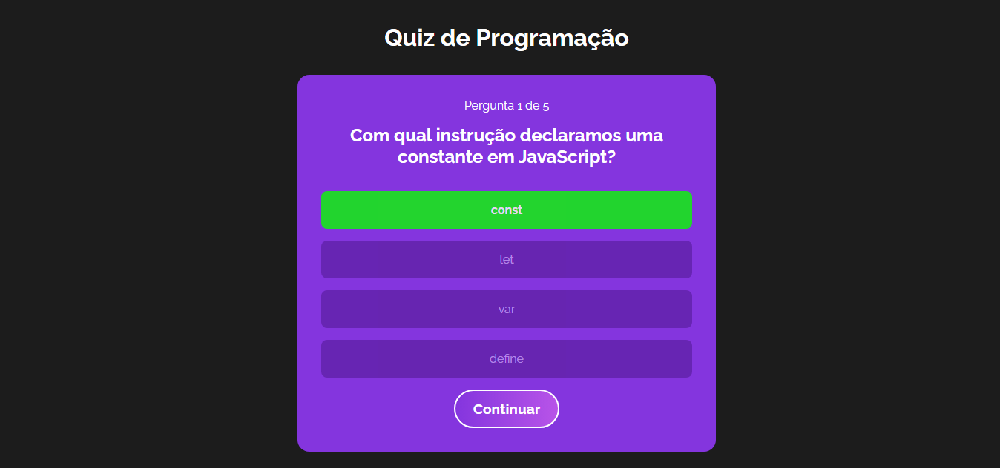

# Quiz de Programação

Esse projeto apresenta 5 perguntas básicas de programação e mostra a pontuação final.

## Comandos utilizados nesse projeto

### `npm create vite@latest`

Cria um projeto Vite + React.js

> Nome do projeto: quiz

> Framework: react javascript

> *npm install* para instalar os pacotes

### `npm run dev`

Comando utilizado para rodar a aplicação no localhost.

## Extensões utilizadas

> ES7+ React/Redux/React-Native snippets