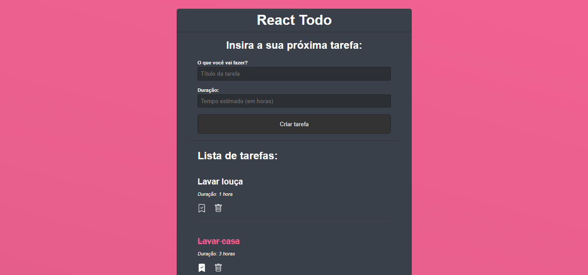

# To-Do

Projeto que cria tarefas (to-do) e se comunica com o banco de dados através dos métodos HTTP com o Fetch API do javascript.

## Comandos utilizados nesse projeto

### `npx create-react-app todo`

Cria um projeto React.js

### `npm install json-server react-icons`

Instala o servidor JSON que opera como um banco de dados e o react-icons, que é uma biblioteca de ícones.

### `npm start`

Comando utilizado para rodar a aplicação no localhost.